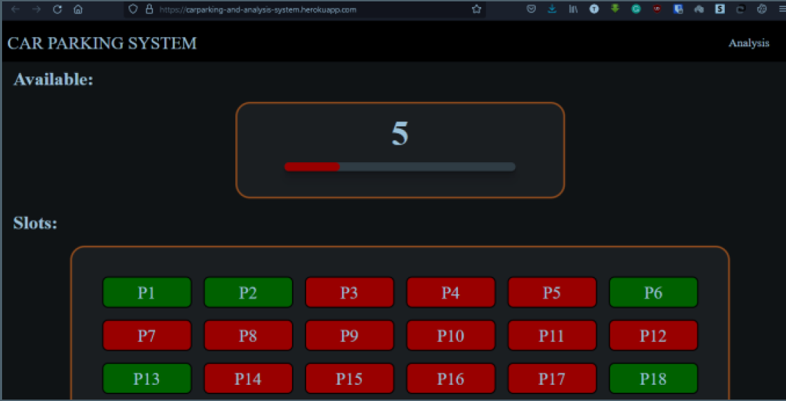
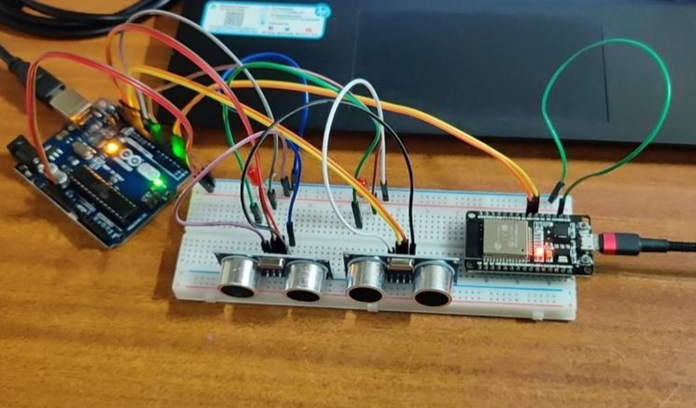

# Smart Parking System

## Table of Contents

- [About](#about)
- [Installation](#installation)
- [Screenshots](#screenshots)


## About

This project aims to develop a smart car parking system that utilizes private land properties, relieving pressure on public agencies and creating new revenue streams. By leveraging current connectivity trends, it seeks to engage new market entities. The system provides real-time parking availability information, guides users to open slots, and offers historical data. It employs a distributed architecture with a centralized cloud database using Firebase Realtime Database. Security measures are implemented, and the front-end is built with React JS. Hardware components include Arduino UNO, ultrasonic sensors, and ESP-8266 for vehicle detection and data transmission.Our project is a website that serves as a platform for users to ask and answer questions on various topics. It works on a reward-based system where users who provide helpful answers are eligible for receiving tokens based on Ethereum's ERC-20 standard. The website is similar to Quora but with the added incentive of earning tokens. The website has a user-friendly interface and provides various features like asking and answering questions, upvoting and liking questions, searching for specific topics, and a user profile page. The platform's main aim is to provide a community-driven space where users can share their knowledge and earn rewards in return.

## Installation

1. Clone the repository:

   ```bash
   git clone https://github.com/Adithya-M-Dileep/smart-parking-system
   ```
2. Install the dependencies:
   ```bash
   cd smart-parking-system
   npm install
   ```
3. Set up the database and configure the necessary environment variables.
4. Start the server.
   ```bash
   npm start
   ```
## Screenshots




